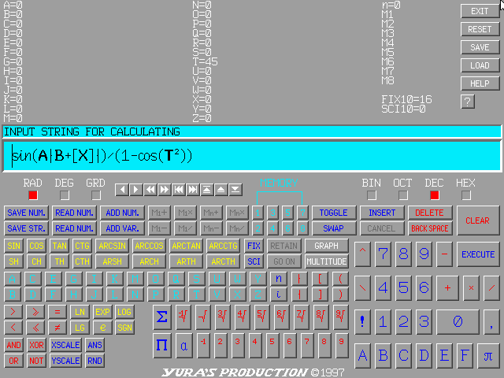
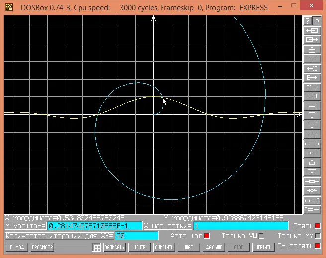

# Graphing Calculator for DOS (1997–2000)

Built in high school for fun. Full-featured engineer-grade calculator with long math expression evaluation, multiple variables, statistics support, and flexible graphing abilities. **Zero library dependencies.**



---

## What it does

- **Expression parser** — evaluates arbitrarily complex math expressions up to 1024 characters, with three bracket types carrying different semantics: `( )` for grouping, `[ ]` for floor/integer part, and `|...|` for absolute value
- **logical operations in expression** - allow to specify several expressions depending on some conditions which can be useful for building piecewise functions
- **26 variables** and **10 memory cells** — each can hold a number or an expression referencing other variables, with a per-variable auto-recalculate flag for iterative computation
- **Full math library** — trig (sin, cos, tan, ctan and inverses), hyperbolic functions, natural roots of degrees 2–9, powers, logarithms (ln, lg, log base N), factorial, sign, and more
- **4 number systems** — decimal, binary, octal, hexadecimal; all can be specified as fractional; switchable per-expression with per-token number base
- **Angle measure per token** — each trig function in an expression can independently use radians, degrees, or gradians
- **Summation operator Σ** and **Product operator Π** — iterates `i` from 0 to `n-1`, enabling numerical integration in a single expression
- **Statistical buffer** — up to 111 values; supports sum, product and any statistical operations over the set which can be represented by sum or product of mathematical evaluation over the elements
- **Parametric graphing** — up to two simultaneous graphs, explicit or parametric, with pan and zoom via keyboard and mouse
- **Live coordinate display** — cursor position shown in math coordinates in real time
- **Built-in help system** — operator precedence table, keyboard shortcut pages, graphing guide

---

## What it doesn't use

No libc. No graphics library. No math library. No input library. Everything is implemented from scratch or using OS direct calls:

| What | How |
|------|-----|
| Math functions | x87 FPU instructions (`FSIN`, `FCOS`, `FSQRT`, `FYL2X`, `FPATAN`, `F2XM1`...) |
| Fractional number → string | `FBSTP` — FPU stores directly as packed BCD, 18 digits in 9 bytes |
| Video output | Direct write to VGA memory, Mode 12h (640×480×16 colors) |
| Fonts | Hand-drawn bitmaps, pixel by pixel, including all mathematical symbols |
| Fade in/out | DAC reprogramming via ports `0x3C8/0x3C9` — no framebuffer changes |
| Mouse input | INT 33h callback in assembly (`MOUSEASM.ASM`) — driver passes data in registers |
| Keyboard input and file I/O | direct OS interaction using INT 16h and INT 21h in inline assembly |
| Processor detection | Flag-register tricks through the full x86 family chain (8086 → 286 → 386 → 486 → Pentium) |

---

## Numerical integration example

The Σ operator makes numerical integration possible in a single expression. To approximate ∫(x²*dx) from A to B we need to replace x with linear interpolation expression from i `i/(n-1)×(B-A)+A`, and dx with `(B-A)/n`:

```
Σ((i/(n-1)×(B-A) + A)² × (B-A)/n)
```

With `A=0`, `B=5`, `n=100000`: result is `41.666875` (exact: `125/3 = 41.666666(6)`).

---

## Screenshots

| Main screen | Graphing mode |
|-------------|---------------|
|  |  |

The program still runs under DOSBox.

---

## Source files

| File | Description |
|------|-------------|
| `STRCOUNT.CPP` | Expression parser — lexer, operator stack, recursive bracket evaluation |
| `FPULARG1.ASM` | All FPU math — wrappers around x87 instructions with error handling |
| `MOUSEASM.ASM` | Mouse interrupt handler — assembly required, driver passes data in registers |
| `CPUIDCPP.ASM` | CPU/FPU detection — full chain from 8086 to Pentium via flag register tricks |
| `GRAPH18.CPP` | VGA Mode 12h graphics — direct video memory access |
| `Calcfont.cpp` | Bitmap font rendering |
| `calcgraf.cpp` | Graphing mode — parametric plotting, pan, zoom, coordinate display |
| `calcmul.cpp` | Statistical buffer |
| `calchelp.cpp` | Built-in help system |
| `CALCEDL.CPP` | Expression input editor |

Source files use **CP866 encoding** (standard DOS Cyrillic). Russian comments in `.cpp` and `.asm` files may display incorrectly in some viewers. Original file modification dates: 1997–2000. Git timestamps reflect upload date.

---

## Building

The project was built with **Borland C++ 5** (final version) and **Turbo Assembler**. An earlier version (1998) targets the older Borland C for DOS. No modern build system exists — this is a historical artifact.

---

## Background

Written by Yuriy Yevtukhov in Ukraine, starting around 1997, at age 16. A longer writeup of how it was built — the parser, the FPU tricks, the DAC fade effect, the mouse interrupt architecture — is available as an article: *[link to article]*

---


